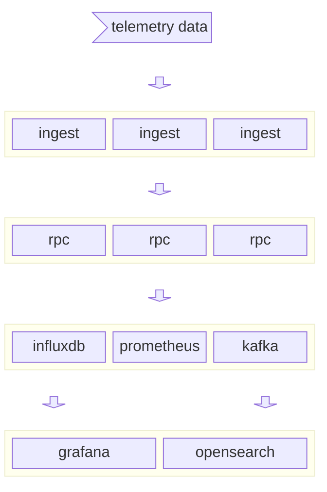

# Formula Telemetry

Open source sim-racing telemetry

## Work in progress

This repository contains zero finished code and is very much a work in progress.

## Overview
I like playing the F1 simarcade games and I like OpenTelemetry. I thought it would be a fairly painless lift to read the telemetry data because the [spec](https://answers.ea.com/t5/General-Discussion/F1-23-UDP-Specification/m-p/12633159?attachment-id=704910) is publicly available, convert that to metrics with OpenTelemetry and chart them with Grafana. Then I thought it might be helpful to convert the data into protocol buffers so that others could easily make their own telemetry applications.

Some more fun things I want to do with it:
- gRPC service to ingest the data using protobufs. not sure if this would be very useful for the realtime charting, but it could be for storing tables of data if somebody wanted to make a webservice
- kafka streams?
- opentelemetry

## Usage

### Kubernetes

#### Using Tilt

This project uses [Tilt](https://tilt.dev); `tilt up` will start the services in Kubernetes and forward the Grafana port to the host - i.e. you can view the dashboard at http://localhost:3000 

This assumes that a Kubernetes cluster is running on your machine. If you use `kind` and have `ctl-ptrl` installed, `make k8s-cluster` will create a cluster and registry for `formulatel`. Otherwise, you'll need to create a cluster before bringing up the application with `tilt`.

### Locally

This application is interesting because it charts F1 telemetry data while you race, but those are provided by Grafana and some backend store like InfluxDB. Because of this, running locally involves running the `ingest`, and `rpc` services as well as a datastore and Grafana, and configure them to work with one another, which is generally a lot more hassle than it's worth.

## Goals

Much of what's in this repo may not be pragmatic because one of the goals I have for this project is to play around with some new technologies. I doubt many sim-racers will be interested in this and those that are probably aren't playing F123, but the end goal is to produce some kind of open racing sim telemetry specification.

- [~] have fun!
- [x] grafana dashboards reading from k8s cluster (see helm chart `prometheus-community/kube-prometheus-stack`)
- [ ] chart telemetry data
- [ ] build a dashboard for interesting telemetry data
- [ ] realtime chart?
- [ ] opensearch?
- [ ] insights? A lofty goal to be certain, but it'd be cool to alert on realtime data (ideal breaking point? racing line? I don't know) or maybe predict when the tires will die or something.

In the future, I hope to add support for more ingestion types and improve / standardize the protobufs as an open spec so that they can be used for more than one racing game and people can build their own stuff.

## Architecture

`formulatel` is two services:
- `ingest` - a service that consumes telemetry data from some source; e.g. via packets over a local UDP connection
- - In this is the functionality responsible for converting raw telemetry data into the backend format
- `rpc` - a horribly named service that receives telemetry data in `formulatel` protobuf format and adds it to the data store.

Right now, the only telemetry data supported is from EA/Codemaster's F123 and that logic is built into `ingest`.

Similarly with `rpc`, there's only one backend for now; the first goal is just to chart some metrics, then we'll build a dashboard and eventually try to get things charted in real time.

