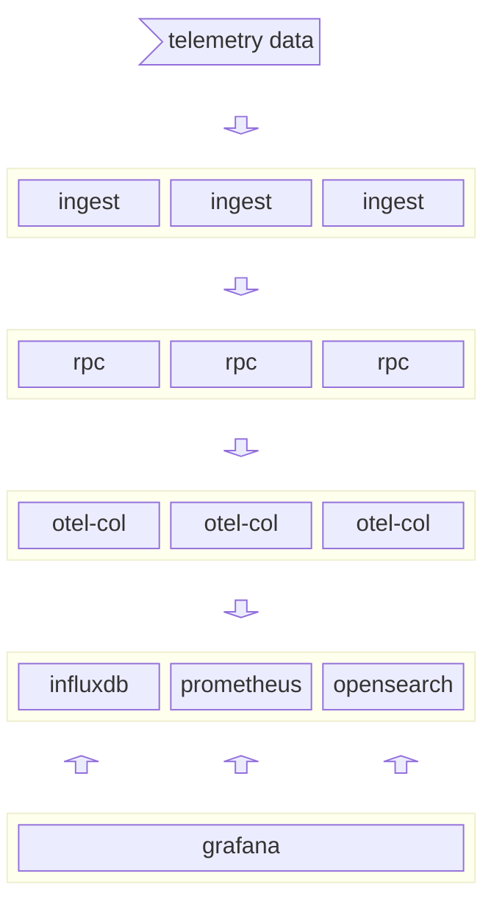

# Formula Telemetry

Open source sim-racing telemetry

## Work in progress

This repository contains zero finished code and is very much a work in progress. Much of what's in this repo may not ever be pragmatic because one of the goals I have for this project is to play around with some new technologies. Eventually, I'll figure out what I think is best and remove the extraneous pieces.

## Overview
I like playing the F1 simarcade games and I like OpenTelemetry. I thought it would be a fairly painless lift to read the telemetry data because the [spec](https://answers.ea.com/t5/General-Discussion/F1-23-UDP-Specification/m-p/12633159?attachment-id=704910) is publicly available, convert that to metrics with OpenTelemetry and chart them with Grafana. Then I thought it might be helpful to convert the data into protocol buffers so that others could easily make their own racing telemetry applications.

Right now, I'm learning about opentelemetry and initially thought I would write some kind of service that OT captured the metrics for, but after some reading it looks like I may just want to write a collector distribution.

## Problems

Some of the problems I've encountered so far include:

- I'm pretty stupid
- I got excited about a bunch of different technologies and overwhelmed myself
- I really wanted to build this "on top" or with OpenTelemetry because I want to learn about that project and contribute to it, but after writing a bit of code, I'm not sure that the car metrics align very well with open telemetry's metrics.
- Initially I thought that it would make sense to use the collector to take in telemetry from a bunch of different sources and export them to a persistent storage for charts after a race and some type of "more live" storage to view during the race. In practise, I think what I'm discovering is that showing metrics in realtime is expensive if I want something quicker than say a 100ms poll. One neat idea I had was to use my phone as a car dashboard "app", but it would only make sense with a very low latency stream. Grafana Live may well be a good choice.
- I really wanted to provide a backend service that a racer could just "send telemetry to"; I wanted to separate the ingestion from the charting so that if somebody wanted to extend it or add support for another game, they would just need to write the frontend part. When I implemented this, I realized that the "backend" service I was providing was just recording metrics and that if I want to chart something in real-time I'd want to skip that extra hop and record them directly from the ingestion service.

## Usage

### Kubernetes

#### Using Tilt

This project uses [Tilt](https://tilt.dev); `tilt up` will start the services in Kubernetes and forward the Grafana port to the host - i.e. you can view the dashboard at http://localhost:3000 

This assumes that a Kubernetes cluster is running on your machine. If you use `kind` and have `ctlptl` installed, `make k8s-cluster` will create a cluster and registry for `formulatel`. Otherwise, you'll need to create a cluster before bringing up the application with `tilt`.

### Docker

I should make a docker-compose for this at some point

## Goals

- [x] have fun!
- [x] grafana dashboards reading from k8s cluster (see helm chart `prometheus-community/kube-prometheus-stack`) **note**: I'm now trying to rip out the prom/grafana parts of the opentel demo
- [x] chart telemetry data
- [ ] generic racing telemetry<->metric conversion? It will be a hassle to turn each protobuf into a metric manually, is there a better way?
- [ ] build a dashboard for interesting telemetry data
- [ ] realtime charting with something like Grafana Live
- [ ] opensearch?
- [ ] insights? A lofty goal to be certain, but it'd be cool to alert on realtime data (ideal breaking point? racing line? I don't know) or maybe predict when the tires will die or something.
- [ ] eBPF packet inspection and routing - it'd be neat to route packets directly from the syscall using eBPF.

In the future, I hope to add support for more ingestion types and improve / standardize the protobufs as an open spec so that they can be used for more than one racing game and people can build their own stuff.

## Architecture

`formulatel` is two services:
- `ingest` - a service that consumes telemetry data from some source; e.g. via packets over a local UDP connection
- - In this is the functionality responsible for converting raw telemetry data into the backend format
- `rpc` - a horribly named service that receives telemetry data in `formulatel` protobuf format and adds it to the data store.

Right now, the only telemetry data supported is from EA/Codemaster's F123 and that logic is built into `ingest`.

Similarly with `rpc`, there's only one backend for now; the first goal is just to chart some metrics, then we'll build a dashboard and eventually try to get things charted in real time.

